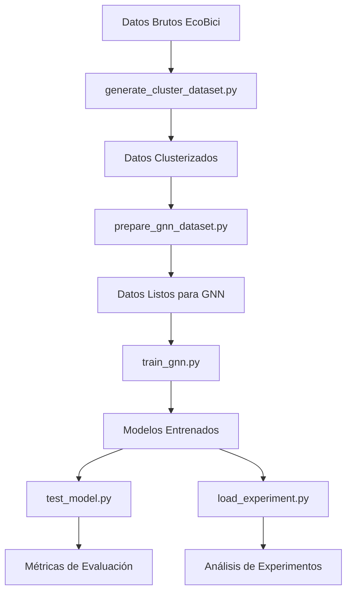

# Scripts de EcoBici-AI

Esta carpeta contiene los scripts principales para el procesamiento de datos y entrenamiento de modelos de Graph Neural Networks (GNN) para predicción de demanda de bicicletas en el sistema EcoBici.

## 📋 Índice

1. [Flujo de Trabajo Completo](#-flujo-de-trabajo-completo)
2. [Scripts Disponibles](#-scripts-disponibles)
3. [Instalación y Prerrequisitos](#-instalación-y-prerrequisitos)
4. [Guía de Uso Paso a Paso](#-guía-de-uso-paso-a-paso)
5. [Ejemplos Prácticos](#-ejemplos-prácticos)
6. [Troubleshooting](#-troubleshooting)

## 🔄 Flujo de Trabajo Completo



## 📚 Scripts Disponibles

### 1. `generate_cluster_dataset.py`
**Propósito**: Genera datasets clusterizados a partir de los datos originales de EcoBici.

**Funcionalidades**:
- Carga y fusiona datasets (viajes, clima, usuarios)
- Crea divisiones temporales sin filtración de datos
- Aplica clustering K-means a las estaciones
- Genera características a nivel de cluster
- Maneja datos demográficos de usuarios y modelos de bicicletas

### 2. `prepare_gnn_dataset.py`
**Propósito**: Prepara los datos clusterizados para entrenamiento de Graph Neural Networks.

**Funcionalidades**:
- Elimina características que causan filtración de datos
- Crea secuencias temporales para cada cluster
- Construye grafos espaciales entre clusters
- Estructura datos en formato PyTorch Geometric
- Optimiza el uso de memoria con procesamiento paralelo

### 3. `train_gnn.py`
**Propósito**: Entrena modelos de Graph Neural Networks para predicción de demanda.

**Funcionalidades**:
- Soporte para múltiples arquitecturas GNN (GCN, GAT, GraphSAGE, Transformer, Hybrid)
- Comparación entre diferentes modelos
- Configuración reproducible con seeds
- Early stopping y guardado de mejores modelos
- Métricas detalladas de evaluación

### 4. `test_model.py`
**Propósito**: Evalúa modelos GNN entrenados en el conjunto de prueba.

**Funcionalidades**:
- Carga modelos desde checkpoints
- Evaluación en datos de prueba
- Cálculo de métricas de rendimiento
- Opción para guardar predicciones

### 5. `load_experiment.py`
**Propósito**: Carga e inspecciona experimentos guardados.

**Funcionalidades**:
- Visualiza resúmenes de experimentos
- Muestra arquitecturas de modelos
- Analiza historial de entrenamiento
- Carga modelos entrenados para inspección

## ⚙️ Instalación y Prerrequisitos

### Dependencias Principales
```bash
# Instalar dependencias desde requirements.txt
pip install -r requirements.txt

# Dependencias específicas clave:
# - polars: Procesamiento eficiente de datos
# - torch: Framework de deep learning
# - torch-geometric: Extensión para Graph Neural Networks  
# - scikit-learn: Clustering y métricas
# - numpy, pandas: Manipulación de datos
# - tqdm: Barras de progreso
```

### Estructura de Datos Esperada
```
data/
├── trips_with_weather.parquet    # Viajes con datos meteorológicos
├── trips.parquet                 # Datos de viajes
├── users.parquet                 # Datos de usuarios
└── clustered/                    # (se crea automáticamente)
    ├── train_cluster_features.parquet
    ├── val_cluster_features.parquet
    ├── test_cluster_features.parquet
    └── dataset_metadata.json
```

## 🚀 Guía de Uso Paso a Paso

### Paso 1: Generar Datasets Clusterizados

```bash
# Uso básico
python scripts/generate_cluster_dataset.py

# Con parámetros personalizados
python scripts/generate_cluster_dataset.py \
    --data_dir data \
    --output_dir data/clustered \
    --n_clusters 93 \
    --dt_minutes 30 \
    --train_end_date "2023-01-01" \
    --val_end_date "2023-07-01" \
    --random_state 42 \
    --use_checkpoints
```

**Parámetros principales**:
- `--data_dir`: Directorio con datos originales (default: `data`)
- `--output_dir`: Directorio de salida (default: `data/clustered`)
- `--n_clusters`: Número de clusters K-means (default: 93)
- `--dt_minutes`: Intervalo de tiempo en minutos (default: 30)
- `--train_end_date`: Fecha fin de entrenamiento (default: `2023-01-01`)
- `--val_end_date`: Fecha fin de validación (default: `2023-07-01`)
- `--use_checkpoints`: Usar checkpoints para reanudar procesamiento
- `--clear_checkpoints`: Limpiar checkpoints existentes

### Paso 2: Preparar Datos para GNN

```bash
# Preparación básica
python scripts/prepare_gnn_dataset.py

# Con configuración personalizada
python scripts/prepare_gnn_dataset.py \
    --input_dir data/clustered \
    --output_dir data/gnn_ready \
    --sequence_length 24 \
    --k_neighbors 5 \
    --distance_threshold 5.0 \
    --target arr_external_count
```

**Parámetros principales**:
- `--input_dir`: Directorio con datos clusterizados (default: `data/clustered`)
- `--output_dir`: Directorio de salida (default: `data/gnn_ready`)
- `--sequence_length`: Longitud de secuencias temporales (default: 24)
- `--k_neighbors`: Vecinos más cercanos para conectividad (default: 5)
- `--distance_threshold`: Distancia máxima en km para conexiones (default: 5.0)
- `--target`: Variable objetivo a predecir:
  - `arr_external_count`: Llegadas externas
  - `dep_external_count`: Salidas externas
  - `both_external_counts`: Ambas
  - `all_external_demographics`: Todas las variables demográficas
- `--no_multiprocessing`: Desactivar procesamiento paralelo

### Paso 3: Entrenar Modelos GNN

```bash
# Entrenar todos los modelos (comparación)
python scripts/train_gnn.py --model all

# Entrenar un modelo específico
python scripts/train_gnn.py --model gat

# Entrenamiento personalizado
python scripts/train_gnn.py \
    --model gat \
    --data_dir data/gnn_ready \
    --epochs 200 \
    --learning_rate 0.001 \
    --hidden_dim 256 \
    --num_layers 4 \
    --dropout 0.3 \
    --patience 20 \
    --experiment_name "gat_experiment_v1"
```

**Modelos disponibles**:
- `gcn`: Graph Convolutional Network
- `gat`: Graph Attention Network
- `sage`: GraphSAGE
- `transformer`: Graph Transformer
- `hybrid`: Modelo híbrido espacio-temporal
- `all`: Todos los modelos (comparación)

**Parámetros principales**:
- `--model`: Tipo de modelo a entrenar
- `--data_dir`: Directorio con datos preparados (default: `data/gnn_ready`)
- `--epochs`: Número de épocas (default: 100)
- `--learning_rate`: Tasa de aprendizaje (default: 0.001)
- `--hidden_dim`: Dimensión oculta (default: 128)
- `--num_layers`: Número de capas GNN (default: 3)
- `--dropout`: Tasa de dropout (default: 0.2)
- `--patience`: Paciencia para early stopping (default: 15)
- `--seed`: Semilla para reproducibilidad (default: 42)

### Paso 4: Evaluar Modelos

```bash
# Evaluar modelo específico
python scripts/test_model.py --model_path experiments/gnn/final_model.pt

# Con configuración personalizada
python scripts/test_model.py \
    --model_path experiments/gnn/comparison_gat/final_model.pt \
    --data_dir data/gnn_ready \
    --model_type gat \
    --save_predictions
```

**Parámetros principales**:
- `--model_path`: Ruta al modelo guardado (requerido)
- `--data_dir`: Directorio con datos de prueba (default: `data/gnn_ready`)
- `--model_type`: Tipo de modelo si no se puede inferir
- `--device`: Dispositivo (cuda/cpu/auto)
- `--save_predictions`: Guardar predicciones en archivo

### Paso 5: Inspeccionar Experimentos

```bash
# Resumen de experimento
python scripts/load_experiment.py experiments/gnn/comparison_gat --summary

# Información detallada
python scripts/load_experiment.py experiments/gnn/comparison_gat --all

# Cargar modelo específico
python scripts/load_experiment.py experiments/gnn/comparison_gat --load-model
```

**Parámetros principales**:
- `experiment_path`: Ruta al directorio del experimento (requerido)
- `--summary`: Mostrar resumen del experimento
- `--architecture`: Mostrar detalles de arquitectura
- `--history`: Mostrar historial de entrenamiento
- `--load-model`: Cargar el modelo entrenado
- `--all`: Mostrar toda la información disponible

## 💡 Ejemplos Prácticos

### Ejemplo 1: Pipeline Completo desde Cero

```bash
# 1. Generar datos clusterizados
python scripts/generate_cluster_dataset.py \
    --n_clusters 100 \
    --use_checkpoints

# 2. Preparar para GNN
python scripts/prepare_gnn_dataset.py \
    --target both_external_counts \
    --k_neighbors 6

# 3. Entrenar modelo GAT
python scripts/train_gnn.py \
    --model gat \
    --epochs 150 \
    --experiment_name "gat_bicounts_v1"

# 4. Evaluar resultado
python scripts/test_model.py \
    --model_path experiments/gnn/gat_bicounts_v1/final_model.pt \
    --save_predictions
```

### Ejemplo 2: Comparación de Modelos

```bash
# 1. Preparar datos con configuración estándar
python scripts/prepare_gnn_dataset.py

# 2. Ejecutar comparación completa
python scripts/train_gnn.py \
    --model all \
    --epochs 100 \
    --save_results

# 3. Inspeccionar resultados
ls experiments/gnn/comparison_results/
cat experiments/gnn/comparison_results/model_comparison.csv
```

### Ejemplo 3: Experimento con Hiperparámetros

```bash
# Modelo con dimensiones grandes
python scripts/train_gnn.py \
    --model transformer \
    --hidden_dim 512 \
    --num_layers 6 \
    --num_heads 12 \
    --dropout 0.1 \
    --learning_rate 0.0003 \
    --epochs 200 \
    --experiment_name "transformer_large"

# Evaluar y comparar
python scripts/test_model.py \
    --model_path experiments/gnn/transformer_large/final_model.pt
```

## 🔧 Troubleshooting

### Problemas Comunes

#### 1. Error de memoria durante preparación de datos
```bash
# Solución: Desactivar multiprocesamiento
python scripts/prepare_gnn_dataset.py --no_multiprocessing
```

#### 2. Error al cargar modelo entrenado
```bash
# Solución: Especificar tipo de modelo
python scripts/test_model.py \
    --model_path path/to/model.pt \
    --model_type gat
```

#### 3. Datos no encontrados
```bash
# Verificar estructura de datos
ls -la data/
ls -la data/clustered/
ls -la data/gnn_ready/
```

#### 4. Error de CUDA/GPU
```bash
# Forzar uso de CPU
python scripts/train_gnn.py --device cpu
```

### Logs y Depuración

Todos los scripts generan logs detallados:
- `generate_cluster_dataset.py`: `cluster_dataset_generation.log`
- Los demás scripts imprimen logs en consola

Para mayor detalle:
```bash
# Ejecutar con verbosidad
python scripts/train_gnn.py --model gat 2>&1 | tee training.log
```

### Verificación de Resultados

```bash
# Verificar archivos generados
find data/clustered -name "*.parquet" -exec ls -lh {} \;
find data/gnn_ready -name "*.pt" -exec ls -lh {} \;
find experiments/gnn -name "*.pt" -exec ls -lh {} \;

# Verificar métricas
python scripts/load_experiment.py experiments/gnn/comparison_gat --summary
```

## 📊 Métricas y Evaluación

Los modelos se evalúan con las siguientes métricas:
- **Loss**: Mean Squared Error (MSE)
- **RMSE**: Root Mean Squared Error
- **MAE**: Mean Absolute Error  
- **R²**: Coeficiente de determinación

### Interpretación de Resultados

- **Loss < 0.1**: Excelente rendimiento
- **R² > 0.8**: Modelo explicativo muy bueno
- **RMSE**: Comparar con la desviación estándar de los targets

## 🎯 Consejos de Optimización

### Para Mejor Rendimiento
1. **Usar checkpoints** en `generate_cluster_dataset.py` para pipelines largos
2. **Ajustar `k_neighbors`** según la densidad de clusters
3. **Experimentar con `sequence_length`** (12-48 pasos temporales)
4. **Usar early stopping** para evitar overfitting

### Para Menos Uso de Memoria
1. **Reducir `sequence_length`**
2. **Usar `--no_multiprocessing`**
3. **Procesar datasets más pequeños** temporalmente

### Para Mejor Calidad de Modelo
1. **Aumentar `hidden_dim`** y `num_layers`
2. **Ajustar `learning_rate`** (probar 0.0001-0.01)
3. **Experimentar con diferentes targets**
4. **Usar validación cruzada temporal**

---

Para más información sobre la implementación, consulta la documentación en `/src/models/README_GNN.md`. 